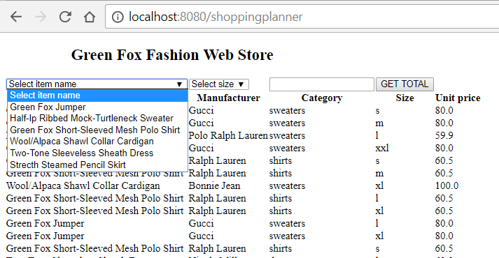

# Pallida Orientation Exam Retake

## 1) Green Fox Fashion Web Store

Build a webshop that people can use to order some merchandise from the Greenfox store.

# Main page

The main page should render an HTML displaying the full list of clothes(explained above)

The table should be automatically rendred by the data returned from the `/warehouse` endpoint.



- the **frontend** should have
    - a heading with the title of the site
    - dropdown list with all unique name options
    - dropdown list with all unique size options
    - input field to set the quantity of clothes
    - list the clothing items of the database in table
    - a GET TOTAL button which displays the total amount ordered by the user

### Ordering the items

If the `/check` endpoint returns OK, then display a message under the heading that the items can be ordered at the returned price OR display the error message in the `result` key. 

#### Styling

Add green background to the message if the cloths can be ordered and red if there were an error.

## Endpoints

You should create these endpoints:

### GET `/warehouse`

Return all rows in the `warehouse` SQL table:

```json
{
    "result": "ok",
    "clothes":
    [
        {
            "id": "21",
            "item_name": "Strecth Steamed Pencil Skirt",
            "manufacturer": "Calvin Klein",
            "category": "skirts",
            "size": "s",
            "unit_price": 39.0,
        },
        {
            "id": "24",
            "item_name": "Strecth Steamed Pencil Skirt",
            "manufacturer": "Calvin Klein",
            "category": "skirts",
            "size": "m",
            "unit_price": 39.0,
        },
    ]
}
```

### GET `/price-check/?item=[string]&size=s&quantity=[integer]`
 - Item is the value of the item_name column
 - The size query string parameter identifies the size of the item
 - The quantity query string parameter is used to check the availability of the item by the given amount

In the `warehouse` database table the `in_store` column stores how many items are available.

Return the following JSON if the quantity is larger than 3:

```json
{
    "result": "ok",
    "total_price": "390"
}
```

Return the following JSON if the quantity is larger than available:

```json
{
    "result": "error, we don't have enough items in store"
}
```

Return the following JSON if the quantity is smaller than 3:

```json
{
    "result": "please order at least 3, one for yourself, two for your friends"
}
```

## 2) Quiz time

 - What is a middleware and why it's used? (2p)
 - What's the main difference between the `onload` and the `readystatechange` provided by the `XMLHttpRequest` object? (1p)
